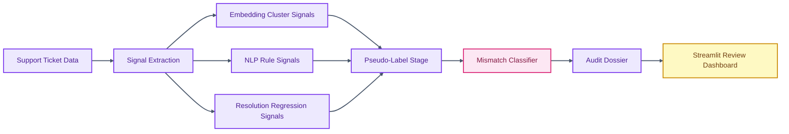

# Support Integrity Auditor

<p align="center">

  
  
  
  
  
</p>

<p align="center">
  <strong>An evidence-grounded auditor for detecting priority mismatch, escalation risk, and resolution quality issues in support tickets.</strong>
</p>

Support Integrity Auditor turns support-ticket data into actionable quality signals. It combines embedding analysis, rules, classifier stages, regression checks, and dossier generation to help teams identify where stated priority and customer impact are misaligned.

## Core Capabilities

- Builds pseudo-labels and classifier stages for priority-mismatch detection.
- Combines semantic, rule-based, and resolution-regression signals.
- Generates auditor-style dossiers for review and investigation.
- Includes dashboard components, adversarial test cases, and saved evaluation outputs.

## Technical Architecture

The pipeline separates signal generation, staged modeling, dossier creation, dashboard presentation, and training scripts. This structure keeps experimentation, prediction, and review surfaces independently maintainable.

## Architecture Diagram



## Technology Stack

- PyTorch, Transformers, PEFT, and sentence-transformers for language modeling workflows.
- scikit-learn, XGBoost, LightGBM, UMAP, and imbalanced-learn for structured modeling.
- Streamlit and Plotly for interactive review dashboards.
- Pandas, NumPy, SciPy, and evaluation libraries for analysis.
- JSON schema and results artifacts for reproducible audit outputs.

## Repository Structure

- `src/signals` - Signal extraction modules.
- `src/stage1_pseudo_labels.py` - Pseudo-label generation.
- `src/stage2_classifier.py` - Classifier workflow.
- `src/stage3_dossier.py` - Dossier generation.
- `app/streamlit_app.py` - Dashboard entry point.
- `train_pipeline.py` - Training pipeline runner.

## Getting Started

```bash
python -m venv .venv
source .venv/bin/activate
pip install -r requirements.txt
```

```bash
python train_pipeline.py
streamlit run app/streamlit_app.py
```

## Professional Context

This project demonstrates applied machine learning for enterprise support quality, with attention to interpretability, validation, and reviewer workflows.
